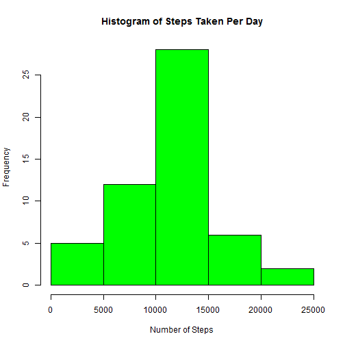
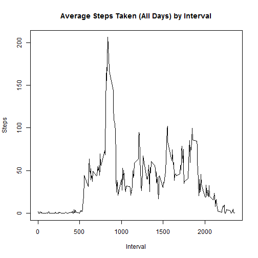
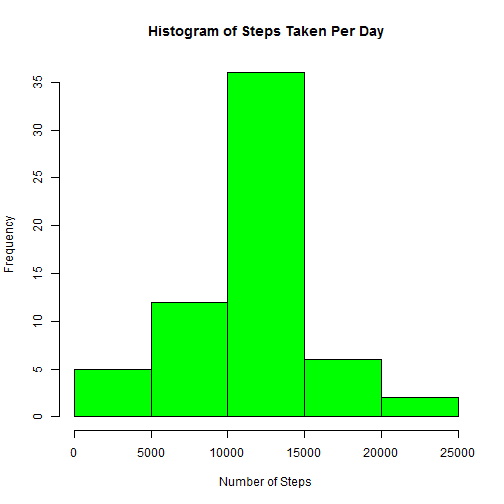
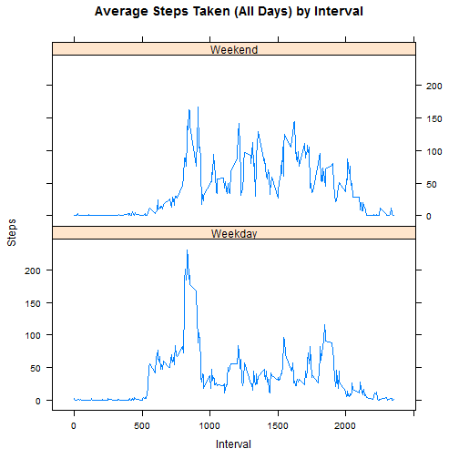

##Introduction
This assignment makes use of data from a personal activity monitoring device. This device collects data at 5 minute intervals through out the day. The data consists of two months of data from an anonymous individual collected during the months of October and November, 2012 and include the number of steps taken in 5 minute intervals each day. 

This data was provided for download from the course website.  The dataset is titled "Activity Monitoring data" and is contained in activity.zip.

##Parts 1 - 3:  Read data, Histogram of Steps per Day, Mean and Median

**Unzip and read file in**

```r
if (!file.exists('activity')) 
  unzip('activity.zip')
activity <- read.csv('activity.csv') 
```

**Ignoring missing values, sum the total steps taken per day**

```r
steps_day <- aggregate(steps ~ date, activity, sum)
```

**Create histogram of steps taken per day**

```r
hist(steps_day$steps, main = "Histogram of Steps Taken Per Day", xlab = "Number of Steps", col = "green")
```



**Calculate Mean and Median steps taken per day**

```r
stepmean <- mean(steps_day$steps)
stepmedian <- median(steps_day$ste)
stepmean
```

```
## [1] 10766.19
```

```r
stepmedian
```

```
## [1] 10765
```
**Summary**
We can see the data was properly read into R for analysis.
The histogram gives us a representation of the distribution of total steps taken per day.  The distribution appears to be normal.  The mean and median of the total steps taken per day is nearly equal.

##Parts 4 - 5 Average Daily Pattern - Time series plot, Max Interval 
**Time series plot of the 5 minute interval and average steps taken across all days**

```r
steps_interval <- aggregate(steps ~ interval, activity, mean)

plot(steps_interval$interval, steps_interval$steps, type = "l", main = "Average Steps Taken (All Days) by Interval", xlab = "Interval", ylab = "Steps")
```



**Which interval has maximum number off steps**

```r
intervalmax <- steps_interval[which.max(steps_interval$steps),1]
intervalmax
```

```
## [1] 835
```
**Summary**
The time series plot shows the average number of steps taken at each interval.  It appears to be nearly zero for intervals 1 - 500 and then climbs to a peak at the maximum interval of 835.  It then drops, but continues to show some variability.

##Parts 6 - 7  Immputed Values, Histogram, Mean and Median, Difference
**Count number of missing values**

```r
missing <- sum(!complete.cases(activity))
missing
```

```
## [1] 2304
```

**Impute missing values with average steps of interval**

```r
imputed <- transform(activity, steps = ifelse(is.na(activity$steps), steps_interval$steps[match(activity$interval, steps_interval$interval)], activity$steps))
```

**Recalculate previous processes with imputed data**
**Sum total steps taken per day**

```r
steps_day_i <- aggregate(steps ~ date, imputed, sum)
```

**Create histogram of steps taken per day**

```r
hist(steps_day_i$steps, main = "Histogram of Steps Taken Per Day", xlab = "Number of Steps", col = "green")
```



**Calculate Mean and Median steps taken per day**

```r
stepmean_i <- mean(steps_day_i$steps)
stepmedian_i <- median(steps_day_i$steps)
stepmean_i
```

```
## [1] 10766.19
```

```r
stepmedian_i
```

```
## [1] 10766.19
```

**Did imputing values create differences in mean and median steps?**

```r
mean_diff <- stepmean - stepmean_i
median_diff <- stepmedian - stepmedian_i
mean_diff
```

```
## [1] 0
```

```r
median_diff
```

```
## [1] -1.188679
```
**Summary**
I chose to impute the 2304 missing values with the average steps of the interval.  This made very little difference in the historogram.  The mean and median with imputed data are equal. The difference in mean and median with and without imputed data is zero and nearly zero.

##Part 8 Weedend versus Weekday
**Create a factor variable for weekend versus weekday**
**Plot the comparison of weekend versus weekday average steps per interval**

```r
weekday <- c("Monday", "Tuesday", "Wednesday", "Thursday", 
              "Friday")
imputed$day = as.factor(ifelse(is.element(weekdays(as.Date(imputed$date)),weekday), "Weekday", "Weekend"))


steps_interval_i <- aggregate(steps ~ interval + day, imputed, mean)

library(lattice)

xyplot(steps_interval_i$steps ~ steps_interval_i$interval|steps_interval_i$day, main="Average Steps Taken (All Days) by Interval",xlab="Interval", ylab="Steps",layout=c(1,2), type="l")
```




**Summary**
It appears the weekend data has a similar flat line from 0 - 500, or even a little over 500. It also appears the weekend pattern does not contain as large a spike around 800, as the weekday.  The weekend does appear to have a higher average steps from interval 1000 to 2000. While there are similarities in the comparison of Weekend to Weekday step activity, there are also differences in the patterns.
